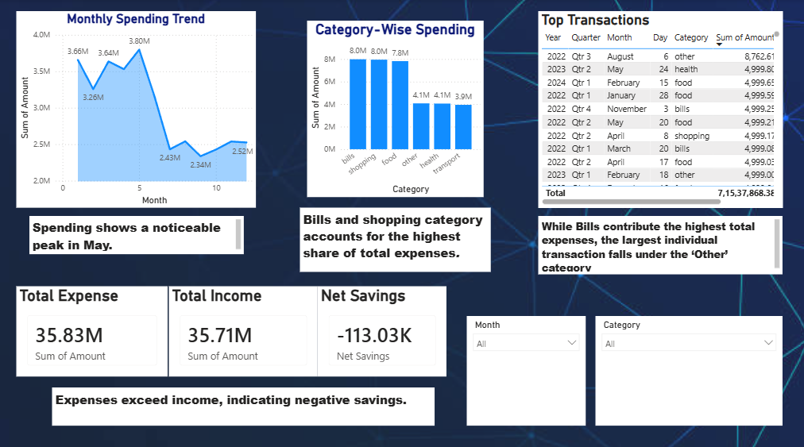

# Expense Analysis Dashboard

## Overview

This project analyzes personal expense data to uncover spending patterns, identify key cost drivers, and generate actionable financial insights. It demonstrates an end-to-end workflow from data cleaning to interactive dashboard creation.

## Objectives

* Analyze income vs expense trends
* Identify highest spending categories
* Track monthly spending behavior
* Detect high-value transactions

## Tech Stack

* **Python** – Data cleaning & transformation
* **SQL (MySQL)** – Data querying & aggregation
* **Power BI** – Interactive dashboard & visualization

## Key Features

* Data preprocessing and cleaning
* Feature engineering (month extraction, categorization)
* SQL-based analysis (category-wise & monthly trends)
* Interactive Power BI dashboard with filters and KPIs
* - 💳 Key financial KPIs:
  - Total Debit
  - Total Credit
  - Savings

## Key Insights

* Bills category contributes the highest share of total expenses, indicating dominance of fixed costs
* Monthly spending shows noticeable fluctuations with peak periods
* High-value transactions are driven by occasional large expenses (e.g., rent, shopping)
* Expense patterns highlight opportunities for cost optimization and improved savings

## Dashboard Preview

## Business Impact

This analysis helps in:

* Understanding fixed vs variable expenses
* Identifying overspending areas
* Improving budgeting and financial planning

## Contact

Open to feedback, suggestions, and collaboration.
